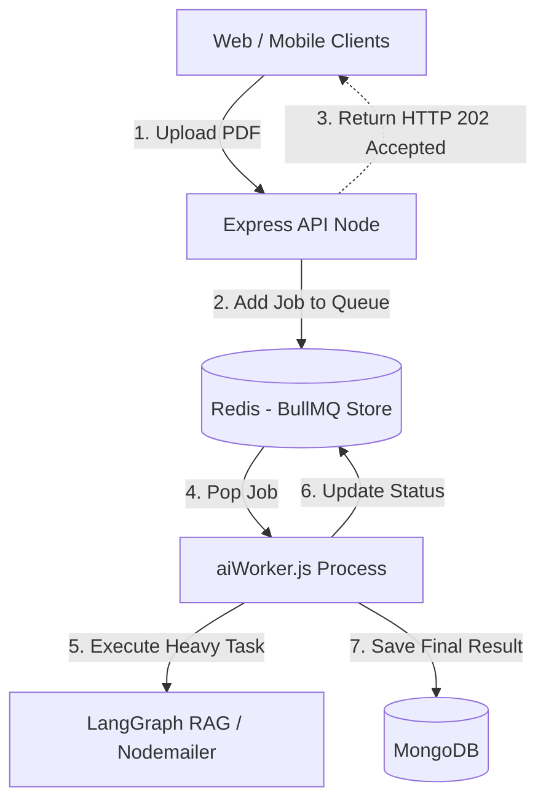

# MediConnect: Backend System Design & Interview Prep

This document serves as a comprehensive preparation guide for backend system design interviews, specifically analyzing the Asynchronous Background Workers module of the MediConnect architecture.

---

## 1. Asynchronous Background Workers ⚙️

### 1.1 Architecture Overview

**Core Design Philosophy:**
The system offloads heavy, synchronous CPU-bound or High-Latency I/O tasks (like AI report generation, PDF parsing, or sending bulk emails) from the main Express.js server to background worker processes. This ensures the main server event loop is never blocked and remains highly responsive to user HTTP requests. It uses **BullMQ** paired with **Redis (`ioredis`)** as the underlying message broker and state manager for robust job queuing.



### 1.2 Deep Dive Concepts
- **Message Broker & Queue Management (BullMQ/Redis):** BullMQ uses Redis' atomic operations (Lua scripts) to manage job states (`waiting`, `active`, `completed`, `failed`, `delayed`). It guarantees that a job is only processed by one worker at a time.
- **Event Loop Offloading:** Node.js runs on a single-threaded event loop. If it parses a 50MB PDF synchronously, the entire server freezes. Offloading to separate worker processes ensures maximum throughput for normal API requests.
- **Exponential Backoff & Retries:** When integrating with external AI APIs (Google GenAI, HuggingFace), transient network failures or rate limits (HTTP 429) are common. The queue is configured to automatically retry failed jobs with increasing delays.

### 1.3 Interview Q&A Bank

**Q1: Why use BullMQ with Redis instead of an in-memory array or Node.js built-in worker threads?**
> **A:** An in-memory queue inside the Node process is volatile. If the server crashes, all pending jobs are lost. Worker threads prevent event loop blocking but don't solve persistence or distributed scaling. BullMQ + Redis provides **persistence**, **state tracking**, and **horizontal scalability**—allowing us to deploy dedicated worker servers (like AWS EC2 instances) entirely separate from our API servers.

**Q2: How does BullMQ ensure a job isn't processed twice by two different workers (The "Exactly-Once" vs "At-Least-Once" problem)?**
> **A:** BullMQ uses Redis Lua scripts to atomically move jobs from the `waiting` list to the `active` list. This atomicity guarantees that even if 50 workers are listening to the same queue, only one worker will successfully acquire and lock a specific job. This provides robust "At-Least-Once" delivery (or "Exactly-Once" if the worker process is perfectly idempotent).

**Q3: An AI analysis job takes 3 minutes, but the Redis connection temporarily drops after 1 minute. What happens to the job?**
> **A:** BullMQ implements a "stalled job" recovery mechanism. Workers periodically heartbeat to Redis to say "I am still working on this job". If a worker crashes or drops its connection, it stops heartbeating. BullMQ detects the stalled job, moves it back to the `waiting` queue, and another worker picks it up.

### 1.4 Edge Cases & Resilience
1. **Poison Pill Jobs:** A PDF file is corrupted and will *always* crash the PDF parser, putting the worker in an infinite loop of crashing and retrying. **Handling:** We configure `attempts: 3` in `aiQueue.js`. After 3 failed retries, BullMQ moves the job to a permanent `failed` state (Dead Letter Queue), preventing it from clogging the system.
2. **Redis Out of Memory (OOM):** If the worker servers go down, the Express server might queue millions of jobs, filling up Redis RAM and crashing the broker. **Handling:** Set a `maxmemory-policy` on the Redis cluster (e.g., `volatile-lru`) and configure BullMQ to automatically delete successful jobs (`removeOnComplete: true`) to keep the memory footprint small.
3. **Graceful Shutdowns:** Deployments or server restarts interrupt active workers mid-task. **Handling:** We hook into Node's `SIGTERM` and `SIGINT` signals. Upon receiving a shutdown signal, the worker stops accepting new jobs and is given a grace period (e.g., 30 seconds) to finish its current active job before exiting.

### 1.5 System Design "Gotchas"
- **"Why not use an Enterprise message bus like Kafka or RabbitMQ?"** An interviewer will test your tooling choice. Kafka is an event-streaming platform designed for massive data pipelines and log aggregation, lacking built-in "delayed retries" and "job state tracking". RabbitMQ is powerful but introduces heavy infrastructural overhead. Redis/BullMQ is lightweight, incredibly fast, and specifically built for standard background job queuing.
- **"How does the client know when the asynchronous job is done?"** You return an HTTP 202 immediately. To update the client, you must implement either **Long Polling**, **WebSockets** (which we have in the `chatController`), or **Push Notifications**. In MediConnect, the worker finishes its task and emits a WebSocket event via the Redis Pub/Sub adapter to push the result live to the user's UI.

---

## 2. System Design Summary

### High-Level Design (HLD): Microservice Separation

By separating the API servers from the Worker servers, we can scale them independently based on CPU vs Network bottlenecks.

```mermaid
graph LR
    subgraph API Cluster (Network Heavy)
        API_1[Express Node 1]
        API_2[Express Node 2]
    end

    subgraph Broker
        RedisCluster[(Redis Cluster - BullMQ)]
    end

    subgraph Worker Cluster (CPU Heavy)
        Worker_1[AI Worker 1]
        Worker_2[AI Worker 2]
        Worker_3[AI Worker 3]
    end
    
    API_1 -->|Push Job| RedisCluster
    API_2 -->|Push Job| RedisCluster
    
    RedisCluster -->|Pop Job| Worker_1
    RedisCluster -->|Pop Job| Worker_2
    RedisCluster -->|Pop Job| Worker_3
```

### Low-Level Design (LLD): Job Configuration & Exponential Backoff

To prevent hammering external AI APIs during outages, the queue enforces exponential backoff logic.

```javascript
// Algorithmic LLD for Queue Enqueueing (aiQueue.js)
import { Queue } from "bullmq";
import { connection } from "../config/redis.js";

// Initialize the asynchronous job queue
export const aiJobQueue = new Queue("ai-analysis-queue", { connection });

export async function enqueueMedicalReport(jobId, rawText) {
  // Add job to BullMQ with strict resilience rules
  await aiJobQueue.add(
    "process-report", 
    { rawPdfText: rawText }, 
    {
      jobId: jobId, // Explicit ID for tracking in frontend via WebSockets
      
      // Edge Case Protection: Poison Pill Prevention
      attempts: 3,  
      
      // Edge Case Protection: API Rate Limiting Handling
      backoff: {
        type: "exponential",
        delay: 2000, // Retries at 2s, then 4s, then 8s
      },
      
      // Memory Management: Keep Redis lean
      removeOnComplete: true,
      removeOnFail: false // Keep failed jobs for manual debugging
    }
  );
  return jobId;
}
```
**LLD Justification:**
- **Exponential Backoff:** If the Google GenAI API is temporarily down, hitting it repeatedly every millisecond will just trigger security blocks. Waiting 2s, 4s, then 8s allows the external API time to recover.
- **Explicit `jobId`:** By tying the BullMQ `jobId` to an ID generated by the Express controller, the frontend can subscribe to a specific WebSocket room (e.g., `room:job_12345`) to listen for real-time progress updates directly from the background worker.
