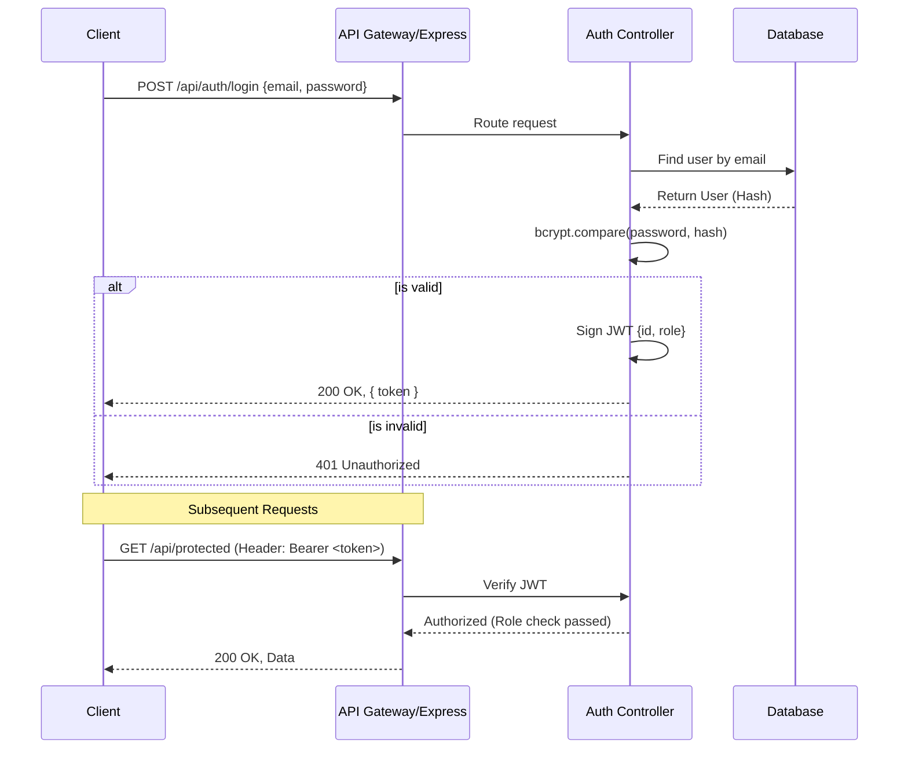

# MediConnect: Backend System Design & Interview Prep

This document serves as a comprehensive preparation guide for backend system design interviews, specifically analyzing the Authentication module of the MediConnect architecture.

---

## 1. Authentication & Identity Management Module 🔐

### 1.1 Architecture Overview

**Core Design Philosophy:**
MediConnect utilizes a **stateless authentication flow** using JSON Web Tokens (JWT) combined with `bcryptjs` for secure password hashing. This approach is highly scalable because the server doesn't need to store session state in memory or a database for every logged-in user. The token itself contains the user's identity and role (Admin, Doctor, User, Lab), allowing for decentralized and fast Role-Based Access Control (RBAC) across various micro-services or API routes.



### 1.2 Deep Dive Concepts
- **Stateless Sessions (JWT):** The server verifies the cryptographic signature of the token rather than looking up a session ID in a database.
- **Role-Based Access Control (RBAC):** Middleware injects the user's role from the JWT payload into the request object, allowing controllers to easily authorize actions based on `req.user.role`.
- **Password Hashing:** `bcryptjs` uses a salt and configurable work factor to protect against rainbow table attacks and brute force.

### 1.3 Interview Q&A Bank

**Q1: Why did you choose JWT over traditional session cookies?**
> **A:** JWTs allow for stateless authentication, which is crucial for horizontal scaling. Traditional sessions require a centralized store (like Redis) to keep track of logged-in users. With JWT, any server instance can verify the token independently using the secret key, reducing database lookups and latency.

**Q2: How do you handle token expiration and revocation in a stateless JWT architecture?**
> **A:** JWTs cannot be easily revoked before they expire. To mitigate this, we use short-lived access tokens (e.g., 15 mins) and long-lived refresh tokens stored securely (e.g., HttpOnly cookies). If immediate revocation is needed (e.g., password reset, compromised account), we implement a Redis blocklist for the compromised token's JTI (JWT ID) until its natural expiration.

**Q3: How does the system defend against Cross-Site Scripting (XSS) and Cross-Site Request Forgery (CSRF)?**
> **A:** By storing the JWT in an `HttpOnly`, `Secure` cookie, we prevent client-side JavaScript from accessing it, mitigating XSS token theft. To prevent CSRF, we implement Anti-CSRF tokens or ensure strict `SameSite` attributes on our cookies.

### 1.4 Edge Cases & Resilience
1. **Compromised Secret Key:** If the JWT signing secret is leaked, attackers can forge tokens with admin privileges. **Handling:** Regular secret rotation and using asymmetric keys (RS256) where the Auth service signs with a private key and other services verify with a public key.
2. **Database Connection Dropped during Login:** User cannot authenticate. **Handling:** Return a standard `503 Service Unavailable` rather than crashing the Node process, and implement robust connection retry logic in Mongoose.
3. **Token Replay Attacks:** **Handling:** Enforce strict HTTPS for all endpoints and use short expirations.

### 1.5 System Design "Gotchas"
- **"What if the JWT payload gets too large?"** Interviewers will ask this. Remember that JWTs are sent with *every* request. If you stuff too much data (permissions, profile info) into the JWT, it bloats header sizes and degrades network performance. Keep it to `userId` and `role`.
- **"Why not use Redis for all sessions?"** While Redis is fast, a pure Redis session architecture introduces state. If Redis goes down, all users are logged out. JWT is preferred for massive scale unless strict server-side revocation is a hard requirement.

---

## 2. System Design Summary

### High-Level Design (HLD): Authentication Flow

MediConnect follows a **modular monolith** approach where the Auth module acts as a strict gatekeeper for all incoming requests.

```mermaid
graph TD
    Client[Web / Mobile Clients] --> API_GW[Express.js / Node Server]
    
    API_GW --> Auth[Auth Module (userController)]
    
    Auth -->|1. Authenticate| DB[(MongoDB)]
    Auth -->|2. Sign Token| JWT[JWT Service]
    
    API_GW -->|Protected Route Request| AuthMW[Auth Middleware]
    AuthMW -->|Verify Token| JWT
    AuthMW -->|Extract Role| Controllers[Other Service Controllers]
```

### Low-Level Design (LLD): Database Schema for User Identity

To support RBAC and secure authentication, the user schema must clearly distinguish roles and protect sensitive fields.

```javascript
// MongoDB Schema Design for User Authentication
const userSchema = new mongoose.Schema({
  email: { 
    type: String, 
    required: true, 
    unique: true, 
    index: true 
  },
  passwordHash: { 
    type: String, 
    required: true,
    select: false // Never return in normal queries
  },
  role: { 
    type: String, 
    enum: ['ADMIN', 'DOCTOR', 'USER', 'LAB'],
    default: 'USER'
  },
  status: {
    type: String,
    enum: ['ACTIVE', 'SUSPENDED', 'PENDING_VERIFICATION'],
    default: 'ACTIVE'
  }
}, { timestamps: true });

// Pre-save hook for password hashing
userSchema.pre('save', async function(next) {
  if (!this.isModified('passwordHash')) return next();
  this.passwordHash = await bcrypt.hash(this.passwordHash, 12);
  next();
});
```
**LLD Justification:**
- **Select False:** The `passwordHash` field is explicitly excluded from default queries (`select: false`) to prevent accidental leakage in API responses.
- **Index:** `email` is indexed because it's the primary lookup key during login, ensuring O(1) or O(log N) read performance.
