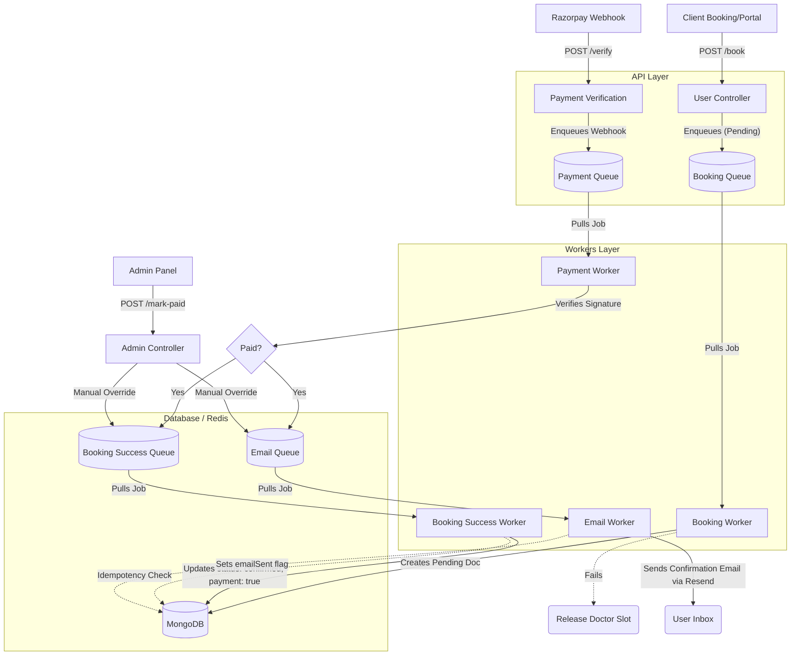

# Booking & Payment Architecture

This document maps out the asynchronous, event-driven architecture that powers the MediConnect booking and payment flows, ensuring reliable execution, fail-safes, and idempotency using BullMQ and Redis.

## Core Flow Architecture

## Key Architectural Decisions

### 1. Synchronous Reservation, Asynchronous Execution
To prevent users from double-booking the exact same slot, the initial check and reservation (updating `slots_booked` on the doctor model) happens synchronously in the controller. The actual heavy database write to create the `appointmentModel` document is offloaded to the **Booking Queue**.

### 2. Distributed Transaction Rollback
If the **Booking Queue** fails permanently (e.g., due to an irrecoverable DB crash during insertion), the worker executes a rollback mechanism to release the synchronously reserved slot back to the doctor.

### 3. Fan-out queues instead of standard Pub/Sub
To fix the "fire-and-forget" vulnerability of Redis Pub/Sub, the **Payment Worker** "fans-out" by pushing explicit jobs to the **Booking Success Queue** and the **Email Queue**. This ensures that even if a worker crashes, the event is retained in Redis and automatically retried upon reboot.

### 4. Idempotency in Workers
Because queue systems guarantee "at-least-once" delivery, workers are inherently idempotent:
- **Booking Success Worker**: Checks if `appointment.payment === true`. If so, it ignores the job.
- **Email Worker**: Checks if `appointment.emailSent === true`. If so, it ignores the job.

### 5. Unified Admin Integration
When an admin manually marks an appointment as paid (e.g., for cash), they bypass Razorpay and push directly to the **Booking Success Queue** and **Email Queue**. This cleanly reuses the exact same downstream processing logic without creating redundant code paths.
