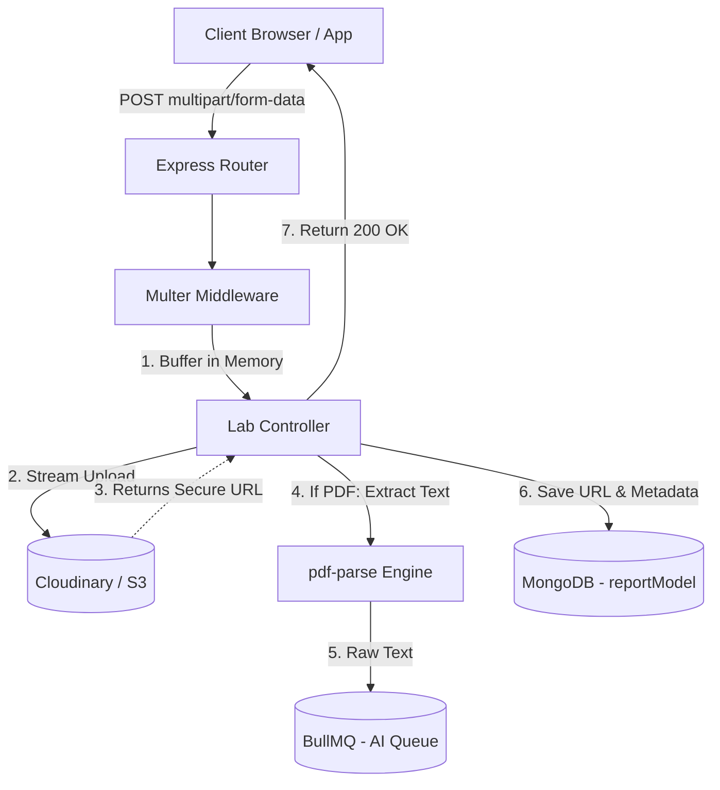
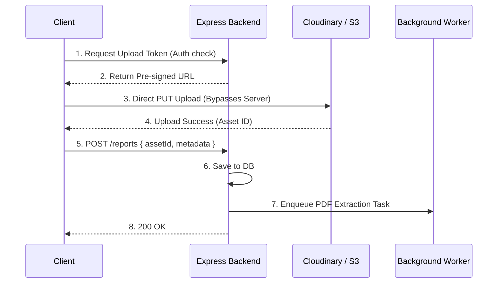

# MediConnect: Backend System Design & Interview Prep

This document serves as a comprehensive preparation guide for backend system design interviews, specifically analyzing the Lab Reports & File Management module of the MediConnect architecture.

---

## 1. Lab Reports & File Management 📄

### 1.1 Architecture Overview

**Core Design Philosophy:**
Handling file uploads in a Node.js environment requires strict memory management. This architecture utilizes `multer` to intercept `multipart/form-data` streams from the client. Instead of saving these files locally (which breaks horizontal scalability and statelessness), the files are buffered in memory and immediately streamed to **Cloudinary** for secure Cloud Object Storage and CDN delivery. Concurrently, if the file is a PDF, `pdf-parse` extracts the raw text to feed the AI RAG pipeline via BullMQ.



### 1.2 Deep Dive Concepts
- **Multipart/Form-Data Parsing:** Standard JSON payloads cannot handle binary file data efficiently. `multer` acts as a busboy wrapper to parse the binary stream boundary markers in the HTTP request.
- **Cloud Object Storage & CDN:** Cloudinary acts as an Object Store (like AWS S3) combined with a Content Delivery Network (CDN). The files are stored redundantly across availability zones, and fetched by clients via edge locations globally, reducing latency.
- **Memory vs. Disk Storage:** In a serverless or Dockerized environment, the local filesystem is ephemeral. Multer is configured to use memory storage (`multer.memoryStorage()`) so the file is held in RAM just long enough to be uploaded to Cloudinary, ensuring the server remains stateless.

### 1.3 Interview Q&A Bank

**Q1: Why did you choose Cloudinary/S3 instead of storing the files directly in MongoDB using GridFS?**
> **A:** MongoDB is optimized for structured query data, not serving large binary blobs. Storing files in a database drastically inflates database size, slows down backups, and consumes expensive database RAM/CPU for simple I/O tasks. Cloudinary/S3 provides infinitely scalable, cheap object storage and pairs it with a CDN for edge caching, completely offloading the network egress burden from our primary database.

**Q2: What happens if a thousand users upload 50MB PDFs at the exact same time?**
> **A:** Our current architecture uses `multer.memoryStorage()`, which would cause a severe Out of Memory (OOM) crash in Node.js because it tries to hold 50GB in RAM. To solve this, we would migrate to **Direct-to-Cloud Uploads (Pre-signed URLs)**. The backend generates a secure, time-limited token, and the client uploads the 50MB file *directly* to Cloudinary, bypassing our Express server entirely.

**Q3: How do you secure sensitive medical lab reports so they aren't publicly accessible on the internet?**
> **A:** Cloudinary supports "authenticated" or "private" delivery types. We configure the upload to be private. When an authorized doctor or patient requests the file, our Express backend verifies their JWT, checks their RBAC permissions, and then generates a time-expiring signed URL to fetch the file from the CDN.

### 1.4 Edge Cases & Resilience
1. **Node.js OOM (Out Of Memory) Crashes:** Processing massive PDFs with `pdf-parse` synchronously blocks the event loop and spikes RAM. **Handling:** Impose strict file size limits (e.g., 5MB max) in the `multer` config. For larger files, offload the `pdf-parse` step to a dedicated background worker.
2. **Orphaned Files:** The file successfully uploads to Cloudinary, but the MongoDB insert fails due to a network glitch. **Handling:** We implement a local try/catch. If the DB save fails, we immediately trigger a Cloudinary API call to delete the newly uploaded asset to prevent paying for unused storage ("orphan cleanup").
3. **Corrupted or Malicious Files:** A user uploads a `.exe` disguised as a `.pdf`. **Handling:** We don't just rely on the file extension. `multer` checks the Mime-Type (`application/pdf`), and we can integrate a quick "Magic Number" byte check on the buffer to guarantee file integrity before allowing the upload.

### 1.5 System Design "Gotchas"
- **"Why extract text on the main server before sending to the AI Queue?"** An interviewer will catch this bottleneck. If `pdf-parse` runs in the main Express controller, it blocks the event loop. The ideal architecture passes the Cloudinary URL to the background worker (`aiWorker.js`), and the worker downloads the PDF and parses it *off the main thread*.
- **"How does this comply with HIPAA data residency?"** Using public SaaS for storage requires strict configuration. You must ensure Cloudinary is configured to store data in specific geographic regions (e.g., US-East only) and that they sign a BAA (Business Associate Agreement) to guarantee encryption at rest and in transit.

---

## 2. System Design Summary

### High-Level Design (HLD): Direct-to-Cloud Upload Flow (Optimized)

To ensure maximum scalability and prevent server OOM errors, a production-grade file upload architecture relies on the Pre-signed URL pattern.



### Low-Level Design (LLD): Database Schema for File Metadata

We must separate the file's binary data (in Cloudinary) from its structured metadata (in MongoDB).

```javascript
// MongoDB Schema Design for Lab Reports
const reportSchema = new mongoose.Schema({
  patientId: { type: mongoose.Schema.Types.ObjectId, ref: 'User', required: true, index: true },
  doctorId: { type: mongoose.Schema.Types.ObjectId, ref: 'Doctor' },
  
  // File Storage Metadata
  fileDetails: {
    cloudinaryAssetId: { type: String, required: true }, // For API deletions
    secureUrl: { type: String, required: true },         // CDN Delivery URL
    originalName: { type: String },
    mimeType: { type: String, default: 'application/pdf' },
    sizeBytes: { type: Number, max: 10485760 }           // 10MB limit enforcement at DB level
  },
  
  // AI Extraction State
  processingStatus: {
    type: String,
    enum: ['PENDING', 'EXTRACTING', 'COMPLETED', 'FAILED'],
    default: 'PENDING'
  },
  
  // The raw text extracted via pdf-parse, used by the RAG system
  extractedText: { 
    type: String, 
    select: false // Excluded by default to save bandwidth 
  }
}, { timestamps: true });

// Index for quickly finding all reports for a patient
reportSchema.index({ patientId: 1, createdAt: -1 });
```
**LLD Justification:**
- **Separation of Concerns:** Only lightweight metadata and pointers (`secureUrl`) are kept in the database.
- **State Tracking:** `processingStatus` allows the UI to show a spinner ("Analyzing Report...") while the background BullMQ worker is running `pdf-parse`.
- **`select: false` on `extractedText`:** The raw OCR text of a medical report can be huge. We only pull it into RAM when the AI agent explicitly queries for it, keeping standard list queries highly performant.
