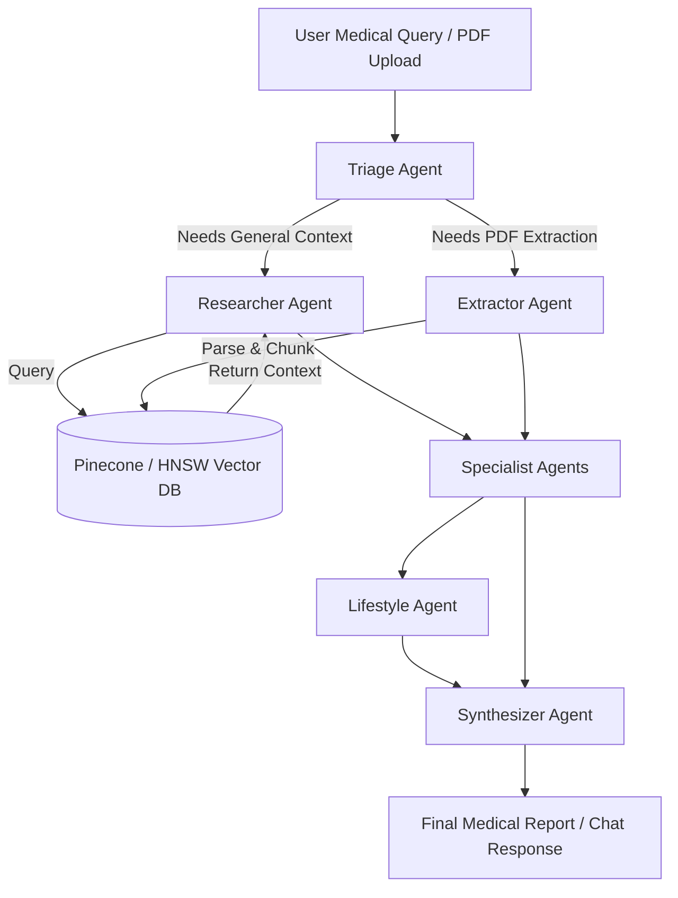
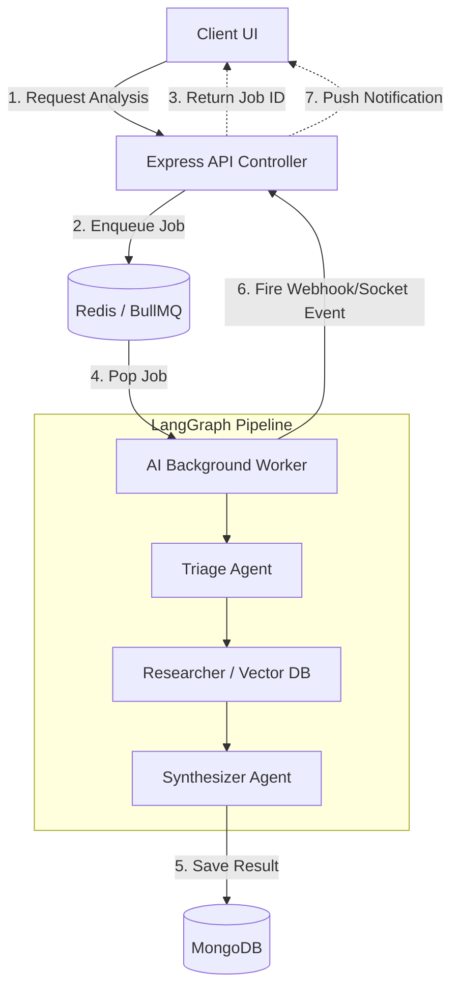

# MediConnect: Backend System Design & Interview Prep

This document serves as a comprehensive preparation guide for backend system design interviews, specifically analyzing the Advanced Multi-Agent AI (RAG Pipeline) module of the MediConnect architecture.

---

## 1. Advanced Multi-Agent AI (RAG Pipeline) 🤖

### 1.1 Architecture Overview

**Core Design Philosophy:**
The system uses a **Directed Acyclic Graph (DAG) orchestration model** powered by LangGraph, rather than a monolithic LLM prompt. By splitting reasoning into specialized agents (Triage, Researcher, Extractor, Specialist, Lifestyle, Synthesizer), the pipeline mimics a real hospital workflow. This modular approach significantly reduces LLM hallucinations, allows independent scaling/swapping of models (e.g., using a cheaper model for extraction and a powerful one for synthesis), and enables robust Retrieval-Augmented Generation (RAG) using Pinecone and local HNSW vector stores.



### 1.2 Deep Dive Concepts
- **Retrieval-Augmented Generation (RAG):** Instead of relying purely on an LLM's internal weights (which can hallucinate or be outdated), RAG converts user queries into vector embeddings (using HuggingFace/Google GenAI) and retrieves semantically similar medical chunks from Pinecone. The LLM is then grounded on this retrieved context.
- **Graph-Based Multi-Agent Orchestration:** LangGraph manages state (`graphState.js`) as it flows from node to node. Each agent is a node. The edges dictate conditional logic (e.g., "If condition is critical, route to Cardiologist Agent; else route to General Physician Agent").
- **Vector Embeddings & Semantic Search:** Text data is converted into high-dimensional arrays (embeddings). Pinecone calculates the cosine similarity between the query embedding and stored document embeddings to find relevant medical knowledge rapidly.

### 1.3 Interview Q&A Bank

**Q1: Why use a multi-agent graph (LangGraph) instead of a single, large, carefully crafted system prompt?**
> **A:** Monolithic prompts suffer from the "lost in the middle" phenomenon when contexts get too large, and they struggle with complex, multi-step reasoning. A multi-agent graph separates concerns. For instance, the Extractor strictly pulls data from PDFs, while the Synthesizer only focuses on tone and formatting. This modularity improves accuracy, makes debugging easier, and allows us to use smaller, faster, task-specific LLMs for intermediate steps.

**Q2: How do you handle privacy and PII (Personally Identifiable Information) when sending medical data to external LLMs?**
> **A:** Before pushing data to external APIs (like Google GenAI), we use a sanitization step (often a local regex or a small local NLP model like HuggingFace Transformers) to mask names, SSNs, and contact info. We only send the clinical symptoms and extracted vitals to the LLM. Furthermore, using enterprise tiers of cloud LLMs ensures zero-data-retention policies.

**Q3: Why do you have both Pinecone and a local HNSW (`hnswlib-node`) vector store?**
> **A:** It provides a tiered caching and fallback architecture. Local HNSW is blazing fast and completely private, used for caching recent queries or parsing small session-specific PDFs directly in memory. Pinecone is our global, persistent knowledge base for generalized medical research that requires massive scale and horizontal search capabilities.

### 1.4 Edge Cases & Resilience
1. **LLM API Rate Limits or Outages:** The Google GenAI API throws a 429 Too Many Requests. **Handling:** LangGraph allows us to build in retry logic with exponential backoff directly into the node edges. If it repeatedly fails, we can implement a fallback strategy to route the prompt to a secondary provider (e.g., HuggingFace Inference API).
2. **Context Window Overflow:** A user uploads a 500-page medical history PDF, exceeding the LLM's context limit. **Handling:** The Extractor Agent chunks the document (e.g., 1000 tokens with 200 token overlap), stores it in the vector DB, and the Researcher Agent only retrieves the top-K most relevant chunks based on the specific query.
3. **Infinite Loops in the Graph:** An edge condition is misconfigured, causing the graph to bounce endlessly between the Triage and Researcher agents. **Handling:** LangGraph execution is wrapped in a recursion limit (e.g., max 10 steps). If the state doesn't reach the Synthesizer within 10 iterations, the graph terminates and returns a safe fallback message.

### 1.5 System Design "Gotchas"
- **"Is vector search alone enough for medical queries?"** Standard vector search (cosine similarity) is poor at exact keyword matching (like a specific medication ID or rare disease name). An interviewer wants to hear about **Hybrid Search**—combining dense vector search (Pinecone) with sparse keyword search (BM25/Elasticsearch) to ensure both semantic relevance and exact term matching.
- **"What happens to the Node.js event loop while these agents run?"** Running LangChain/LangGraph heavy logic synchronously will block Express. Therefore, we push the actual execution of the agent graph to a BullMQ background worker. The Express controller just enqueues the job and returns a 202 Accepted.

---

## 2. System Design Summary

### High-Level Design (HLD): Agentic RAG Worker Flow

Because the RAG pipeline is computationally expensive and relies on external APIs, it is completely decoupled from the main request-response cycle using an event-driven worker queue.



### Low-Level Design (LLD): Algorithmic Approach to Document Chunking & Embedding

To make PDFs searchable, they must be pre-processed before entering the vector database. This LLD focuses on the algorithm inside the `extractorAgent.js`.

```javascript
// Algorithmic LLD for the RAG Extraction & Ingestion Flow
import { RecursiveCharacterTextSplitter } from "langchain/text_splitter";
import { GoogleGenerativeAIEmbeddings } from "@langchain/google-genai";

async function ingestMedicalReport(rawText, patientId) {
  // 1. Chunking Strategy: Recursive split by paragraphs, then sentences
  // Overlap ensures context isn't lost if a medical concept crosses a boundary
  const splitter = new RecursiveCharacterTextSplitter({
    chunkSize: 1000,
    chunkOverlap: 200,
    separators: ["\n\n", "\n", ".", " "],
  });

  const docs = await splitter.createDocuments([rawText]);

  // 2. Embedding Strategy: Convert text chunks into 768-dimensional floats
  const embeddings = new GoogleGenerativeAIEmbeddings({
    modelName: "embedding-001", // Google's embedding model
  });

  // 3. Metadata Tagging: Crucial for multi-tenant isolation
  const vectorsToUpsert = await Promise.all(docs.map(async (doc, i) => {
    const vector = await embeddings.embedQuery(doc.pageContent);
    return {
      id: `patient_${patientId}_chunk_${i}`,
      values: vector,
      metadata: {
        patientId: patientId, // Used for pre-filtering so Alice can't search Bob's records
        source: 'medical_report_pdf',
        text: doc.pageContent 
      }
    };
  }));

  // 4. Upsert to Pinecone
  await pineconeIndex.upsert(vectorsToUpsert);
}
```
**LLD Justification:**
- **Recursive Character Splitting:** Medical reports have complex structures. A recursive splitter intelligently tries to keep paragraphs together rather than cutting off a sentence midway.
- **Metadata Pre-Filtering:** In a multi-tenant healthcare app, vector databases *must* use metadata filtering (`patientId`). Without it, semantic search would return another patient's data if it had higher cosine similarity, which is a massive HIPAA violation.
