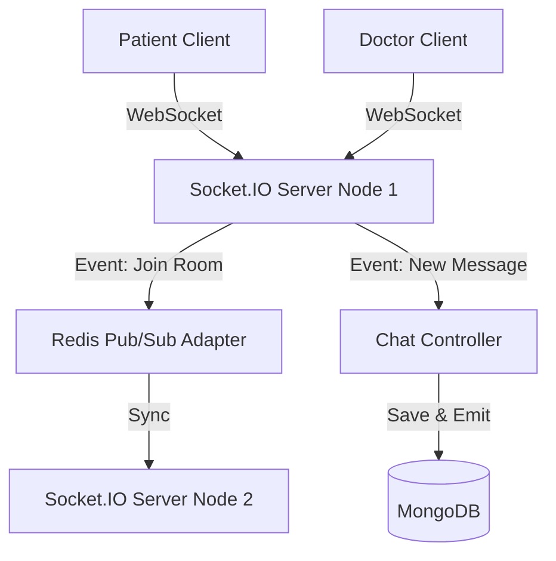
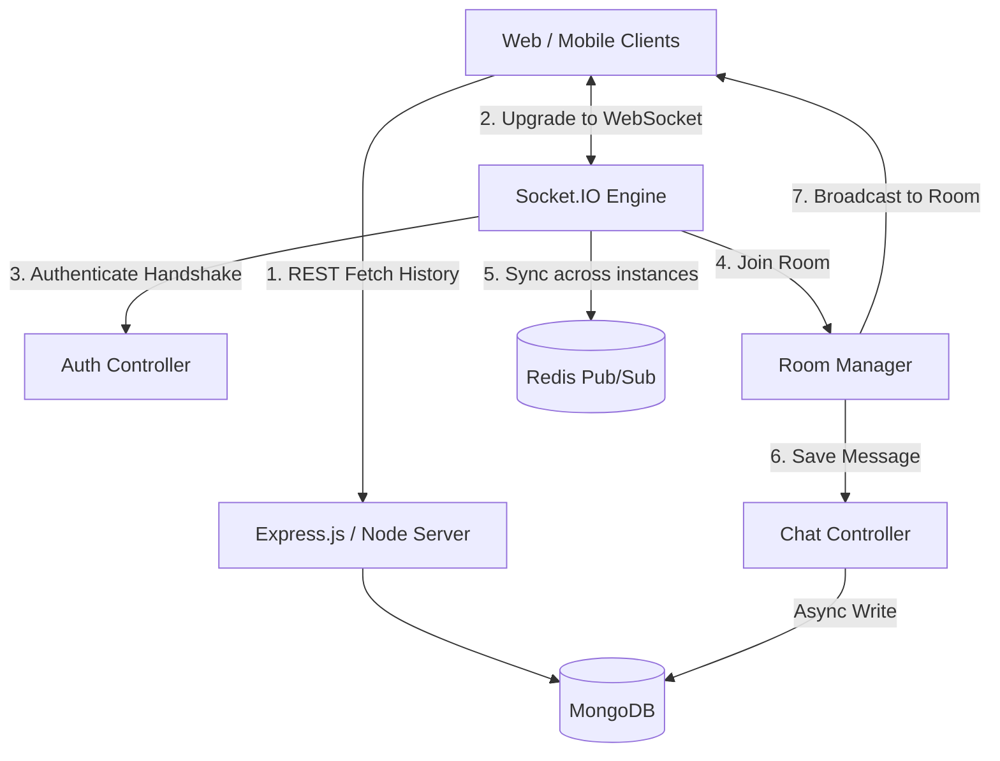

# MediConnect: Backend System Design & Interview Prep

This document serves as a comprehensive preparation guide for backend system design interviews, specifically analyzing the Real-Time Patient Queue & Chat module of the MediConnect architecture.

---

## 1. Real-Time Patient Queue & Chat ⚡

### 1.1 Architecture Overview

**Core Design Philosophy:**
The system uses `socket.io` for bi-directional, event-driven communication. WebSockets are chosen over HTTP Long-Polling or Server-Sent Events (SSE) because the doctor-patient interaction requires low-latency, two-way communication (real-time chat messaging, instant queue status updates). The WebSocket connections are stateful, requiring careful session management and horizontal scaling strategies.



### 1.2 Deep Dive Concepts
- **WebSocket Protocol (ws://):** Provides a persistent, full-duplex connection over a single TCP connection, eliminating the overhead of establishing a new HTTP connection for every message.
- **Rooms and Namespaces:** `socket.io` allows grouping sockets into "rooms" (e.g., `doctor_id_queue` or `appointment_id_chat`). Only clients subscribed to that specific room receive the broadcasted events, ensuring data isolation and privacy.
- **State Synchronization (Redis Adapter):** In a production environment with multiple Node.js instances behind a Load Balancer, a patient might connect to Node A while the doctor connects to Node B. The Redis Pub/Sub adapter ensures that a message emitted on Node A is instantly pushed to Node B, bridging the gap between isolated server processes.

### 1.3 Interview Q&A Bank

**Q1: How do you scale WebSockets horizontally?**
> **A:** WebSockets are stateful. To scale across multiple Node.js instances, we must configure sticky sessions at the load balancer level (e.g., NGINX or AWS ALB) so a client reconnects to the same server during a handshake. Crucially, we implement a Redis Pub/Sub Adapter so all server instances can broadcast messages to rooms regardless of where the target user is physically connected.

**Q2: What happens if the WebSocket connection drops during a live consultation?**
> **A:** `socket.io` has built-in heartbeat mechanisms (ping/pong) and auto-reconnection logic. To handle temporary disconnects without losing data, we store missed chat messages and queue events in the database (MongoDB). Upon successful reconnection, the client fetches the missed state via a standard REST API call before resuming live WebSocket listening.

**Q3: How do you secure the WebSocket connection to prevent unauthorized access to the patient queue?**
> **A:** We perform authentication during the initial WebSocket handshake. We intercept the `connection` event using a custom Socket.IO middleware, extract the JWT from the auth payload or headers, verify it using our Auth module, and forcefully disconnect unauthenticated sockets before they can join any sensitive rooms.

### 1.4 Edge Cases & Resilience
1. **Thundering Herd Problem:** If the server restarts, thousands of clients might try to reconnect simultaneously, overwhelming the CPU and causing a cascade failure. **Handling:** Implement randomized exponential backoff in the client-side reconnection logic.
2. **Message Loss During Network Blip:** A chat message is sent just as the connection drops on a mobile network. **Handling:** Implement message acknowledgments (ACKs) and optimistic UI updates. Store messages in MongoDB before emitting them, and have the client retry if the ACK is not received within a timeout period.
3. **Zombie Connections:** Clients that drop off the network without a formal TCP FIN packet (e.g., entering a tunnel). **Handling:** Rely on server-side ping/pong timeouts (e.g., 30 seconds) to detect dead sockets, forcefully clean up the connection, and update the user's presence state (Online -> Offline) in the database.

### 1.5 System Design "Gotchas"
- **"Why not use Server-Sent Events (SSE) instead?"** An interviewer will test if you blindly chose WebSockets. SSE is unidirectional (Server -> Client). If the patient queue *only* required the server to push updates, SSE is lighter and operates over standard HTTP multiplexing (HTTP/2). However, because MediConnect also includes bi-directional chat, WebSockets are the strictly superior choice.
- **"How does the database handle high-frequency chat writes?"** Writing every single chat message individually to MongoDB during a rapid-fire conversation can bottleneck the DB. A better approach is to batch writes using Redis, or write asynchronously in the background, only confirming to the user that the server received it.

---

## 2. System Design Summary

### High-Level Design (HLD): Real-Time Chat & Queue

MediConnect utilizes a **hybrid request-response and event-driven architecture** for real-time features. The initial connection and historical data fetch use REST, while live updates stream over WebSockets.



### Low-Level Design (LLD): Database Schema for Chat

To support real-time messaging, the database schema must be optimized for fast sequential reads (fetching chat history) and efficient indexing.

```javascript
// MongoDB Schema Design for Real-Time Chat
const chatSchema = new mongoose.Schema({
  appointmentId: { 
    type: mongoose.Schema.Types.ObjectId, 
    ref: 'Appointment', 
    required: true,
    index: true // Extremely important for querying history
  },
  senderId: { 
    type: mongoose.Schema.Types.ObjectId, 
    ref: 'User', 
    required: true 
  },
  receiverId: { 
    type: mongoose.Schema.Types.ObjectId, 
    ref: 'User', 
    required: true 
  },
  message: { 
    type: String, 
    required: true,
    trim: true
  },
  messageType: {
    type: String,
    enum: ['TEXT', 'IMAGE', 'SYSTEM_UPDATE'],
    default: 'TEXT'
  },
  status: {
    type: String,
    enum: ['SENT', 'DELIVERED', 'READ'],
    default: 'SENT'
  }
}, { timestamps: true });

// Compound Indexing for fast history retrieval
// We almost always query messages for a specific appointment, ordered by time.
chatSchema.index({ appointmentId: 1, createdAt: -1 });
```
**LLD Justification:**
- **Indexing:** The compound index `{ appointmentId: 1, createdAt: -1 }` is critical. When a user opens a chat, the client requests the last 50 messages for that `appointmentId`. This index allows MongoDB to instantly retrieve and sort the messages without a collection scan.
- **Message Types:** Supporting `messageType` allows the chat schema to handle not just text, but image uploads (via Cloudinary) or `SYSTEM_UPDATE` events (like "Patient is next in queue").
- **Status Tracking:** The `status` field supports WhatsApp-style read receipts, which are updated via WebSocket events and persisted back to this schema.
