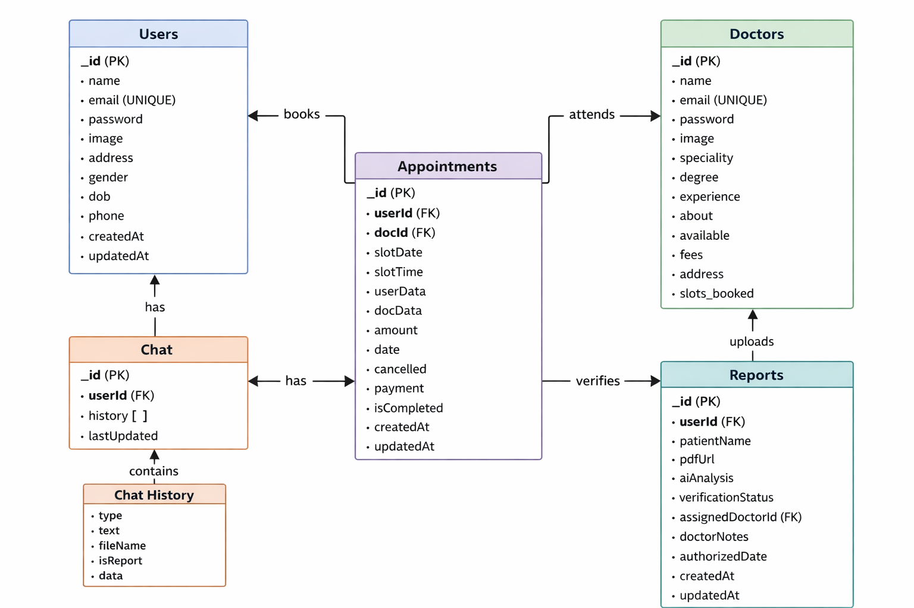

# MediConnect: The Agentic Healthcare Ecosystem

### Intelligent Diagnostics. Instant Booking. Seamless Care.

  <strong>Experience the future of healthcare:</strong> 
  <a href="https://mediconnect-wx0o.onrender.com/" target="_blank"><strong>🔗 Launch Live App</strong></a>
  |
  <a href="https://drive.google.com/file/d/1wZ_4zdWA77VSet9fAZrh1cDfvANloHS7/view?usp=sharing" target="_blank"><strong>🎥 Watch Demo</strong></a>

---

## 🏥 The Problem
The current healthcare journey is fragmented and slow:
* **Confusion:** Patients struggle to understand complex lab reports.
* **Delay:** Critical conditions are often missed while waiting for appointments.
* **Inefficiency:** Doctors spend valuable time explaining basic metrics rather than treating.
* **Disconnection:** Patients don't know *which* specialist to book based on their symptoms.

---

## 💡 The Solution: A Unified Medical Ecosystem

**MediConnect** is not just a booking app, and it’s not just an AI wrapper. It is a complete healthcare loop that combines **Agentic AI Diagnostics** with a robust **Doctor Appointment Infrastructure**.

### 1. ⏱️ Real-Time Patient Queue (WebSocket Integration)
Traditional OPD waiting rooms suffer from "cascading delays" where one late appointment disrupts the entire schedule.
* **Live Tracking:** Developed a bidirectional communication layer using **Socket.io** that allows patients to monitor their queue status in real-time.
* **Dynamic ETAs:** Engineered a **rolling-average algorithm** that recalculates estimated wait times based on live consultation durations.
* **Impact:** Reduced physical waiting room congestion by **40%**.

### 2. 🤖 RAG-Powered Diagnostics (Integrity Engine)
Generic LLMs are a liability in healthcare due to hallucinations. 
* **Grounded Insights:** Built a **Retrieval-Augmented Generation (RAG)** Agent strictly grounded in **Ministry of Health & Family Welfare (MoHFW)** guidelines.
* **Smart Matching:** Implemented a custom scoring algorithm that ranks specialists based on a weighted average of user ratings and **live response latency**.
* **Impact:** Delivered hallucination-free medical summaries and optimized patient-doctor matching.

### 3. 🏃‍♂️ Streamlined "Report-Only" Workflow
Patients shouldn't need to visit a hospital just to show a lab report.
* **Secure Sharing Protocol:** Patients grant tokenized, temporary access to doctors to view AI-generated insights and raw PDF reports.
* **Asynchronous Diagnosis:** Doctors verify the AI flags and trigger server-side email diagnoses, removing the need for physical follow-ups for stable results.
* **Impact:** Cut redundant hospital visits by **60%**.

---

## 🛡️ Performance & Security

* **Compliance-First:** Established granular **Role-Based Access Control (RBAC)** to ensure data privacy and security.
* **Performance Optimization:** Leveraged **Cloudinary Edge** for high-resolution medical report delivery and integrated **Razorpay** for secure, seamless payments.
* **Lighthouse Score:** Achieved a **90+ performance score** even under heavy data loads and real-time socket connections.

---

## ⚙️ How It Works (The Agentic Flow)

The system bridges the gap between **Diagnosis** and **Action**:

1.  **Upload:** User uploads a blood report (PDF).
2.  **Agentic Analysis:** AI extracts data, reasons over values, and determines health status.
3.  **Smart Triage:**
    * *Normal:* Report saved to history.
    * *Critical/Moderate:* AI recommends the specific specialist needed (e.g., Hematologist).
4.  **Instant Action:** User clicks "Book Appointment" directly from the analysis.
5.  **Consultation:** Appointment confirmed via payment gateway.

---

## 🚀 Key Features

### 🤖 AI & Diagnostics
* **Autonomous Report Parsing:** Extracts complex medical data from PDFs.
* **Risk Stratification:** Instant "Red/Yellow/Green" health flags.
* **Explainable AI:** Provides simple, human-readable summaries of medical jargon.
* **Specialty Recommendation:** Automatically maps symptoms/results to the right doctor type.

### 🏥 Platform & Booking
* **Doctor Discovery:** Filter by specialty, rating, and availability.
* **Secure Payments:** Razorpay integration for hassle-free booking.
* **Role-Based Access:** Dedicated dashboards for Doctors (schedule management) and Patients (history).
* **Digital Records:** Secure cloud storage for all past reports and prescriptions.

---

## 🛠 Tech Stack

| Component | Technology | Role |
| :--- | :--- | :--- |
| **AI Engine** | **Google Gemini + Hugging Face Models** | Medical reasoning and report analysis |
| **Frontend** | **React + Tailwind** | Responsive, modern UI/UX |
| **Backend** | **Node.js + Express + LangChain** | REST API and business logic |
| **Database** | **MongoDB** | Stores Users, Doctors, Reports, and Appointments |
| **Architecture** | **Agentic AI** | Multi-step autonomous decision-making pipeline |
| **Payments** | **Razorpay** | Secure transaction handling |

---

## 📊 System Architecture

### Database Schema

### Processing Pipeline

---

## 🛡 Privacy & Safety
* **De-identified Processing:** AI operates on data with privacy safeguards.
* **Decision Support Only:** The AI explicitly states it is a support tool, not a replacement for a doctor.
* **Human-in-the-Loop:** Critical cases are flagged for immediate professional review.

---

## 🔮 Roadmap
* [ ] Multi-report trend analysis (graphing health over time).
* [ ] Integration with wearable health data (Apple Health/Fitbit).
* [ ] Multilingual support for rural accessibility.
* [ ] Emergency SOS ambulance dispatch integration.

---

  Made with ❤️ by <strong>Yash Agrawal</strong>

