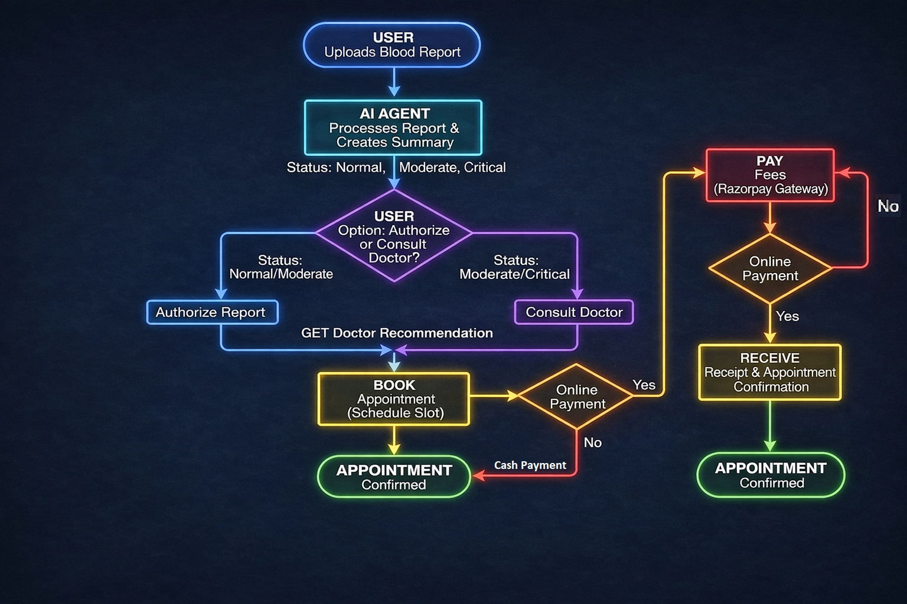
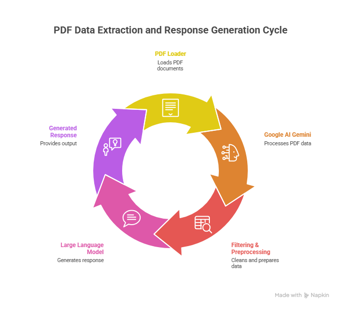

# MediConnect - LabLens 
### The Agentic Medical Intelligence Platform  
**Instant Report Analysis. Smart Triage. Faster Care.**

## The Problem

Healthcare systems are overloaded.

- Patients wait days just to understand basic blood reports  
- Doctors spend time explaining normal values instead of treating critical cases  
- Critical conditions are often delayed due to lack of early triage  
- Patients don’t know when or whom to consult  

---

## The Solution

MedAI CareFlow is not a chatbot.  
It is an Agentic Medical Intelligence System that acts as a pre-clinical decision layer.

It doesn’t just display reports — it reasons:

1. Reads uploaded blood reports (PDF)  
2. Analyzes values using AI agents  
3. Classifies risk: Normal, Moderate, Critical  
4. Guides the patient on next steps  
5. Routes them to the right doctor instantly  

---

## How It Works (Agentic Flow)

---

## Database Schema

### Step-by-Step Flow Explanation

1. **User Uploads Blood Report**  
   The patient uploads a blood report in PDF format.

2. **AI Agent Processes Report**  
   The system extracts medical values, generates a concise summary, and classifies health status as Normal, Moderate, or Critical.

3. **User Decision Point**  
   - For Normal or Moderate results, the user can authorize the report for record keeping.  
   - For Moderate or Critical results, the system recommends consulting a doctor.

4. **Doctor Recommendation**  
   The AI suggests the most relevant medical specialist based on report analysis and risk level.

5. **Appointment Booking**  
   The user selects an available time slot and schedules an appointment.

6. **Payment and Confirmation**  
   The user completes payment through an online gateway, and the appointment is confirmed instantly.

---

## Pipeline Flow

---

## Key Agentic Capabilities

- Autonomous medical report analysis  
- Risk-based patient triage  
- Intelligent doctor-specialty matching  
- Instant guidance without waiting  
- Human-in-the-loop safety via doctor verification  

---

## Business Impact

- Faster medical guidance, reduced from days to seconds  
- Optimized doctor time, focused on moderate and critical cases  
- Early detection and escalation of high-risk cases  
- Reduced healthcare system load  
- Safe AI-driven decision support  

---

## Tech Stack

| Component | Technology | Purpose |
|--------|-----------|--------|
| AI Engine | Gemini | Medical report analysis and reasoning |
| Backend | Node.js | API and business logic |
| Database | MongoDB | Users, doctors, reports, chats |
| Architecture | Agentic AI | Multi-step autonomous decision making |
| Payments | Razorpay | Secure appointment payments |

---

## Core Data Models

- User – Patient identity and profile  
- Doctor – Medical professionals and availability  
- Report – Uploaded medical reports with AI analysis  
- Chat – AI-powered medical conversations  
- Appointment – Relationship between users and doctors  

---

## Privacy and Safety

- AI operates on de-identified data  
- No medical diagnosis, only decision support  
- Doctor verification required for critical cases  
- Full audit trail of AI decisions  

---

## Future Roadmap

- Multi-report trend analysis  
- Wearable device and lab integration  
- Emergency alert escalation system  
- Multilingual medical explanations  
- Insurance and hospital API integration  

---

## Why This Matters

MedAI CareFlow bridges the gap between raw medical data and timely healthcare decisions by providing intelligent, safe, and scalable pre-clinical support.

---

### One-Line Summary

An agentic medical platform that converts blood reports into actionable healthcare decisions in seconds.

---

## 🔗 Live Link

  <strong>Check out the live application here:</strong> 
  <a href="https://mediconnect-wx0o.onrender.com/" target="_blank">MediConnect Live Demo</a>

## Demo Video

(https://drive.google.com/file/d/1wZ_4zdWA77VSet9fAZrh1cDfvANloHS7/view?usp=sharing)
