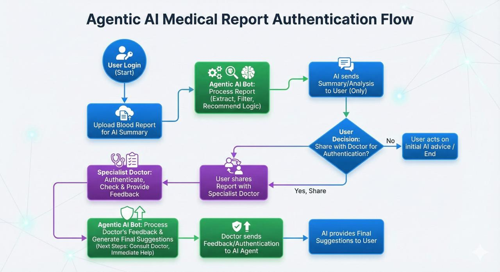

# MediConnect (Smart Lab Assistant) 🩺 
**AI-powered Lab Report Analysis + Specialist Recommendation + Instant Booking**

MediConnect is an **AI-first healthcare platform** that instantly analyzes medical lab reports (PDF) and/or user symptoms, explains the results in **simple language**, recommends the **correct specialist**, and enables **one-click instant booking** with the best available doctors.

---

## Problem Statement

### Core Problem
Patients struggle to interpret complex medical lab reports and identify the correct specialist, leading to delayed treatment and inefficient booking processes.  
This platform uses AI to instantly analyze reports, triage urgency, and auto-match patients with the right available doctors for immediate booking.

### Detailed Problem
- Lab reports contain technical jargon and abnormal values that patients can’t understand.
- Many people panic (Google symptoms) or ignore critical warnings.
- Even after realizing they need help, patients struggle to decide the right doctor type (e.g., Nephrologist vs Urologist).
- Manual searching + poor availability matching delays care.

---

## Solution Overview

### MediConnect / Lab Lens: AI-Powered Digital Triage Assistant
MediConnect bridges the gap between a **Lab Report** and a **Doctor Appointment**:

1. **Instant Report Analysis**
   - Upload lab report PDF OR type symptoms.
   - AI extracts test values + reference ranges.
   - Highlights abnormalities and explains them in plain English.

2. **Smart Specialist Recommendation**
   - AI correlates symptoms + lab findings.
   - Recommends the exact specialist type.
   - Example:  
     `High Creatinine + Fatigue → Nephrologist`

3. **Top Doctor Matching + Instant Booking**
   - System fetches doctors from DB based on specialization.
   - Shows **Top 3 best matches** based on ranking.
   - Provides “⚡ Book Next Slot” button for one-click booking.

---


## Key Impact
✅ Reduces time from *report received → doctor visit* from **days to minutes**  
✅ Prevents medical escalation via urgency-aware triage  
✅ Improves patient confidence and reduces anxiety  
✅ Optimizes doctor schedule utilization

---




## Architecture & Workflow

### 1) Input Layer
- Upload PDF lab report
- OR type symptoms manually

### 2) Processing Layer (Backend)
- **Multer Hybrid Upload**
  - Supports local disk upload + Cloudinary storage
- **Gemini AI (Google Gemini 1.5 Flash)**
  - Extracts test values (name/value/range)
  - Detects abnormal indicators
  - Infers suspected condition + urgency
  - Recommends specialist

### 3) Database Layer (MongoDB)
- Stores doctors, slots, users, reports
- Filters doctors by specialization
- Stores report history (Cloudinary link)

### 4) Presentation Layer (Frontend)
- Shows simplified analysis & abnormal highlights
- Displays recommended specialist
- Lists ranked doctors
- Enables instant booking

---

## Features

###  A. AI Report Analyzer (Gemini Brain)
- Understands medical correlations beyond keywords
- Example:  
  `High Sugar + Thirst + Weight Loss → Diabetes risk`

✅ Works even if report is missing → falls back to symptom-based analysis.

---

###  B. Hybrid File Handling (Error-Resilient)
To prevent common errors like **fetch failure / missing file**, we implemented a universal file handler.

✅ Detects where the report exists:
- Local disk → `fs.readFileSync`
- Cloudinary URL → `fetch`

This makes the platform stable and production-friendly.

---

###  C. Smart Doctor Ranking System ("Sorting Hat")
Instead of random listing, doctors are ranked using weighted scoring:

**Score Formula**
```text
Score = (Experience * 10) - (BookedSlots * 2)
